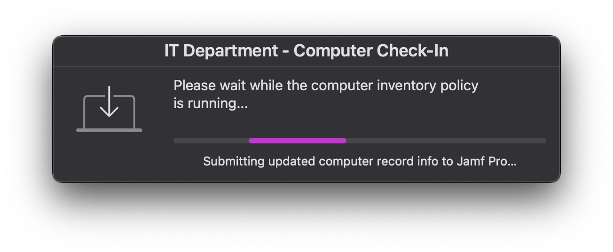

# Jamf Recon user-facing display

## `JamfRecon-SwiftDialog.sh`

SwiftDialog progress UI for running **Jamf Manage** and **Jamf Recon** with end-user friendly status text.

---
### 📝 Description
- Verifies SwiftDialog exists (optionally installs via Jamf policy trigger).
- Runs `jamf manage` then `jamf recon -endUsername <console user>`.
- Streams progress updates to users and logs to `/Library/Logs/JamfReconNotification.log`.

### Requirements
- **Jamf Pro** agent: `/usr/local/bin/jamf`
- **SwiftDialog**: `/usr/local/bin/dialog` (or supply a custom path via parameter)
- **Jamf policy trigger** (optional) to install SwiftDialog if missing

---
### Jamf Parameters
| Param | Purpose                                          | Example                         |
|------:|--------------------------------------------------|---------------------------------|
| `$4`  | Path to SwiftDialog binary                       | `/usr/local/bin/dialog`         |
| `$5`  | Organization name (title text)                   | `IT Department`                 |
| `$6`  | Jamf policy custom trigger to install SwiftDialog| `swftinstaller`                 |

All parameters are **optional**; sensible defaults are used if not provided.

### Requires Self Service Setup
1. **Add Script**: Upload `JamfRecon-swiftdialog.sh`.
2. **Parameters**:
- `$4` = `/usr/local/bin/dialog`
- `$5` = `IT Department` (or your org)
- `$6` = `swftinstaller` (a policy that installs SwiftDialog)
3. **User Interaction**: Show in Self Service with a clear name (e.g., “Check In with Jamf (Inventory)”).
---
### Logging
- Log file: `/Library/Logs/JamfReconNotification.log`
- Both stdout and stderr from Jamf commands are appended.

#### Tested On
- macOS 	14.x,15.x,26.x