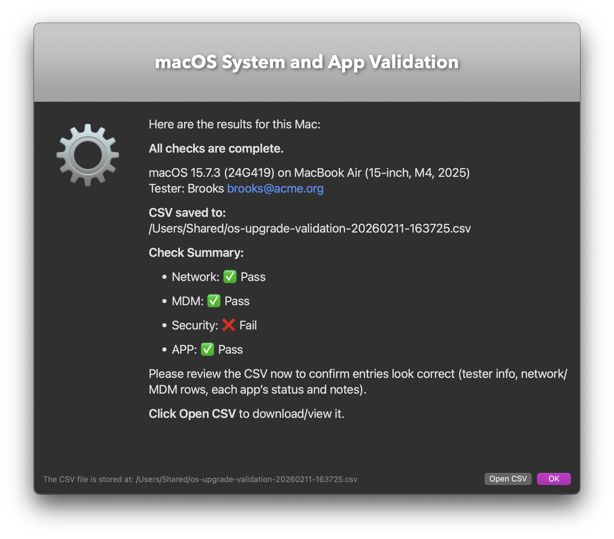

# macOS System and Application Tester

A **guided validation script** for macOS environments managed by Jamf.  
It runs system, network, security, and MDM checks, then launches selected applications one by one, prompting testers to record whether they work. Results are written to a timestamped CSV on the Desktop. It is designed to help **Jamf admins or technicians test macOS applications during upgrades and updates**. 

### macOS-tester.sh

## 📝 Description

- Collects tester name and email via **SwiftDialog**  
- Performs **system/network/security/MDM checks**:
- Network Check: HTTPS reachability for specified URLs Managed Wi-Fi profile detection & current SSID & APNs daemon connectivity
- Security Check: Bootstrap Token escrow status, FileVault & SIP status
- MDM Check: Jamf enrollment & JSS connectivity
- App Check: Launches specified apps (by bundle ID or path), prompts for **Works/Doesn’t Work + notes**, and records results
- Exports results to a **CSV file** for auditing and sharing
- Works in **Jamf Self Service** or from the command line



## Requirements

- macOS 13 – 26  
- [SwiftDialog](https://github.com/bartreardon/swiftDialog) installed at `/usr/local/bin/dialog`  
(if missing, the script can auto-install the latest release)

### Tested On

- macOS 15, 26
- Apple Silicon & Intel Macbook

---

### Jamf Parameters

| Parameter | Name          | Description                                                                 |
|-----------|---------------|-----------------------------------------------------------------------------|
| 4         | `APPS_PARAM`  | List of apps to test (`;`-separated). Supports bundle IDs or `.app` paths.  |
| 5         | `URLS_PARAM`  | List of websites to test (`,` `;` or newline separated). Hostnames auto-prefixed with `https://`. |
| 6         | `DIALOG_PARAM`| (Optional) Override SwiftDialog path. Default: `/usr/local/bin/dialog`.     |
| 7         | `ICON_PARAM`  | (Optional) Override dialog icon. Path to `.icns` or `.app`. Default: system icon. |

---

### Jamf Self Service
Upload the script to Jamf and assign parameters as needed.  
Testers will be prompted through dialogs and results will be saved to their Desktop to be shared internally with other admins or techs.

### Command Line
```bash
sudo ./macOS-tester.sh --tester "Jane Doe" --email "jane@example.com" --apps "com.apple.Safari;/Applications/Microsoft Word.app"
```

### Example CSV Output
```
Timestamp,Tester,Email,OSVersion,OSBuild,Hardware,AppName,BundleID,AppVersion,AppBuild,Result,Notes
2025-09-30 10:12:45,Jane Doe,jane@example.com,15.6,24G222,MacBookPro18,3,Safari,com.apple.Safari,16.6,17618.1,Works,""
2025-09-30 10:14:02,Jane Doe,jane@example.com,15.6,24G222,MacBookPro18,3,Word,com.microsoft.Word,16.90,24092200,Doesn't Work,"Crashes when opening a document"
```

## Notes

- For APNs connectivity, the script tests `api.push.apple.com` on ports **443** and **2197**.  
(Apple documentation indicates **5223** is the primary port for devices; you may adjust as needed.)
- CSV files are saved to the **Desktop** of the logged-in user running the script.

## License

MIT License. See [LICENSE](LICENSE) for details.