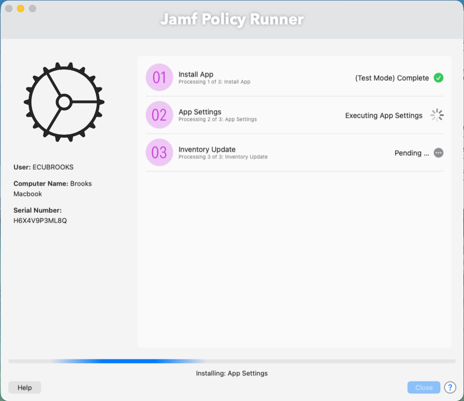
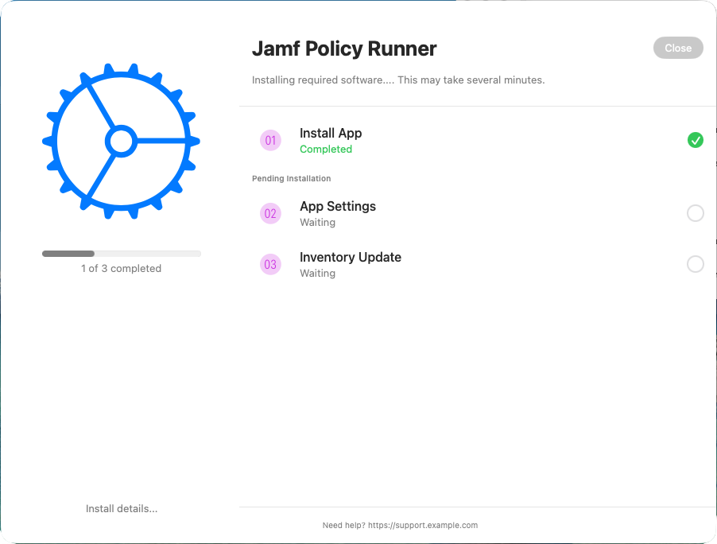
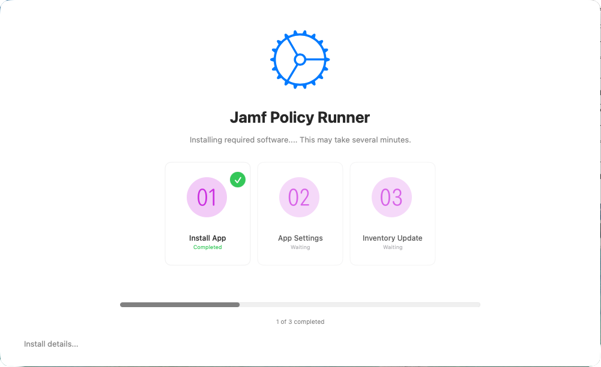

# Policy Installer - SwiftDialog

This script provides a SwiftDialog-based user interface for executing one or more Jamf policy triggers. It's designed to provide users with real-time visual feedback while Jamf runs a series of custom policies behind the scenes.

### policyinstaller-swiftdialog

## 📋 Description

* Accepts Jamf parameters for title, icon, triggers, labels, and support URL
* Supports **test** modes and **live** modes
* Supports both **List Mode** and **Inspect Mode**
* Supports SwiftDialog Inspect Mode `preset1` and `preset2`
* Dynamically builds SwiftDialog list items and progress display
* Locks the dialog until completion
* Tracks failure or success of each policy trigger
* Uses files to track completion in Inspect Mode
* Optionally installs SwiftDialog if not present
* Default color is purple for items but can be changed to match org or school.

> ⚠️ It is recommended to use only `preset1` or `preset2` when using Inspect Mode.  
> Other presets may not behave as expected.

---

### Jamf Policy Parameters

| Parameter | Description                                                  |
| --------- | ------------------------------------------------------------ |
| 4         | Dialog Title *(optional)*                                    |
| 5         | Icon Path *(optional)*                                       |
| 6         | Comma-separated Jamf triggers (e.g. `vpnsetup,inventory`)    |
| 7         | Comma-separated labels (e.g. `Install VPN,Update Inventory`) |
| 8         | Operation mode: `test` or `live` *(default: test)*           |
| 9         | Support URL *(optional)*                                     |
| 10        | UI Mode: `list` (default) or `inspect`                       |
---

### Requirements

* SwiftDialog installed at `/usr/local/bin/dialog`
  *(Optionally remove hashes in code to install swtift using Jamf policy trigger if not found)*
* Jamf binary available in the system path

---

### UI Modes

#### List Mode (Default)

Provides a traditional progress-style interface with dynamic list items and status updates.

#### Inspect Mode

Uses SwiftDialog Inspect Mode to monitor file-based completion markers for each step.  
Designed for more modern workflow tracking using SwiftDialog `preset1` or `preset2`.
Inspect Mode focuses on presentation and workflow visibility, leveraging SwiftDialog’s modern preset-based interface.

### Test Mode

Running in test mode will simulate each step with a short delay and return a success message for all triggers.

---

### Example Jamf Policy Setup

* **Display Name**: `Policy Installer - Swift Dialog - VPN`
* **Category**: Custom
* **Trigger**: `Self Service`
* **Parameters**:

  * `$4`: `VPN Setup Assistant`
  * `$5`: `/System/Library/CoreServices/CoreTypes.bundle/Contents/Resources/GenericNetworkIcon.icns`
  * `$6`: `vpnsetup,configvpn,inventory`
  * `$7`: `Install VPN,Configure Settings,Update Inventory`
  * `$8`: `live`
  * `$9`: `https://your-support-url.com/help`
  * `$10`: `inspect

---

### Cleanup

Temporary files are deleted at the end of script execution.

---

### 🙌 Acknowledgments

This project was inspired by the work of [Dan Snelson](https://github.com/dan-snelson), whose use of SwiftDialog for interactive feedback helped shape this workflow.
